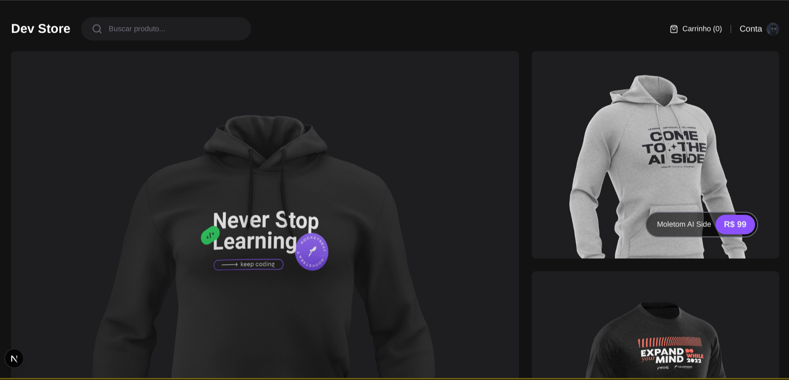
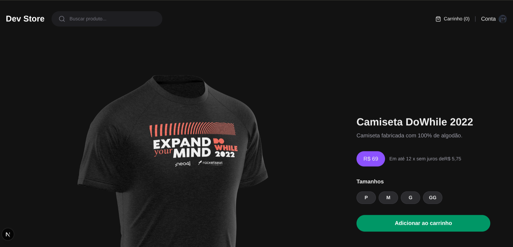
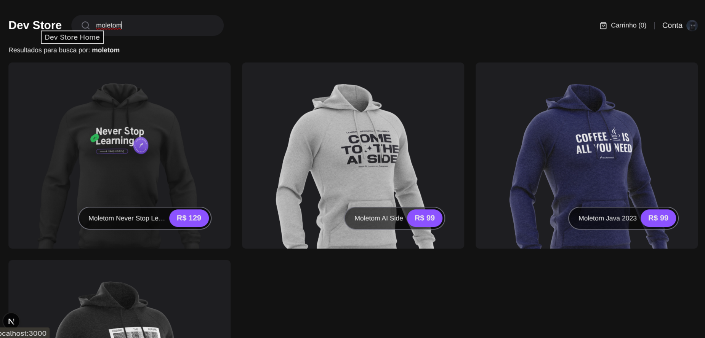

# Dev Store

E-commerce de roupas para desenvolvedores.


Loja virtual para venda de roupas com temática developer, construída com Next.js 16, React 19 e TypeScript.


## Screenshots






## Índice

- [Tech Stack](#tech-stack)
- [Funcionalidades](#funcionalidades)
- [Getting Started](#getting-started)
- [Estrutura de Diretórios](#estrutura-de-diretórios)
- [Scripts Disponíveis](#scripts-disponíveis)
- [Testes](#testes)
- [Screenshots](#screenshots)

## Tech Stack

| Categoria | Tecnologia |
|-----------|------------|
| Framework | Next.js 16 (App Router) |
| Linguagem | TypeScript 5 |
| UI | Tailwind CSS 4 |
| Ícones | Lucide React |
| Validação | Zod |
| Testes Unitários | Vitest + React Testing Library |
| Testes E2E | Cypress |
| Linting/Formatting | Biome |
| Package Manager | pnpm |

## Funcionalidades

- **Home** - Lista produtos em destaque com destaque visual para produto principal
- **Página de Produto** - Detalhes completos, seleção de tamanho, adicionar ao carrinho
- **Busca** - Busca de produtos por termo
- **Carrinho** - Context React para gerenciamento de estado (localStorage)

## Getting Started

### Pré-requisitos

- Node.js 18+
- pnpm 8+

### Instalação

```bash
# Clone o repositório
git clone <repo-url>

# Instale as dependências
pnpm install

# Inicie o servidor de desenvolvimento
pnpm dev
```

A aplicação estará disponível em [http://localhost:3000](http://localhost:3000).

### Build de Produção

```bash
# Criar build de produção
pnpm build

# Iniciar servidor em produção
pnpm start
```

## Estrutura de Diretórios

```
src/
├── app/                    # Next.js App Router pages
│   ├── (store)/            # Grupo de rotas da loja
│   │   ├── (home)/         # Página home
│   │   ├── product/       # Página de detalhes do produto
│   │   └── search/        # Página de busca
│   └── api/               # API Routes
├── components/            # Componentes React
│   ├── header/            # Cabeçalho com busca e carrinho
│   ├── cart-widget/       # Widget do carrinho
│   ├── add-to-cart-button/# Botão adicionar ao carrinho
│   ├── search-form/       # Formulário de busca
│   └── skeleton/          # Componente de carregamento
├── contexts/              # React Contexts
│   └── cart-context.tsx  # Gerenciamento do carrinho
├── types/                 # Definições de tipos TypeScript
├── utils/                 # Funções auxiliares
└── http/                  # Chamadas de API
```

## Scripts Disponíveis

| Comando | Descrição |
|---------|-----------|
| `pnpm dev` | Iniciar servidor de desenvolvimento |
| `pnpm build` | Criar build de produção |
| `pnpm start` | Iniciar servidor em produção |
| `pnpm lint` | Verificar erros com Biome |
| `pnpm format` | Formatar código com Biome |
| `pnpm test` | Executar testes unitários em watch mode |
| `pnpm test run` | Executar todos os testes unitários |
| `pnpm test:e2e` | Executar testes E2E com Cypress |
| `cypress open` | Abrir Cypress em modo interativo |

## Testes

### Testes Unitários

Executados com Vitest + React Testing Library.

```bash
# Modo watch
pnpm test

# Uma execução
pnpm test run

# Com coverage
pnpm test run --coverage
```

### Testes E2E

Executados com Cypress.

```bash
# Modo interativo
cypress open

# Linha de comando
pnpm test:e2e
```


---

Desenvolvido com Next.js e React.
